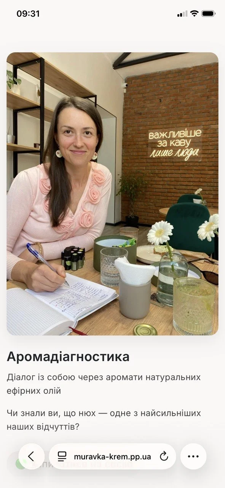

# Muravka-krem

Production-ready Django web application for a natural cosmetics brand with e-commerce functionality, aromadiagnostics service pages, OAuth authentication, analytics integration, and automated deployment pipeline.

---

## 🌿 About the Project

Muravka-krem is a Django web application for a handmade natural cosmetics brand.

The project demonstrates a full-stack implementation of an e-commerce platform with service-based landing pages, authentication via Google OAuth, and CI/CD deployment to AWS infrastructure.

---

## ✨ Features

### Website & Content

- Responsive landing pages
- Product catalog with categories
- Product search
- Pagination
- Aromadiagnostics service page
- Gift certificate section
- About / brand presentation pages

### E-commerce

- Shopping cart
- Checkout flow
- Product catalog with search and category filtering
- Nova Poshta API integration (delivery point selection during checkout)

### Authentication

- Google OAuth 2.0 authentication implemented using django-allauth
- Password-based authentication is disabled
- Users are provisioned automatically from Google account data
- Simplified authentication flow (no signup/password management)

### Media & Analytics

- Cloudinary media storage
- Google Analytics 4 integration
- SEO-friendly structure
- UTM campaign support

### Infrastructure & Deployment

- AWS EC2 deployment
- Nginx reverse proxy
- Gunicorn application server
- PostgreSQL in production
- SQLite for local development
- HTTPS with Let's Encrypt
- GitHub Actions CI/CD pipeline

---

## 🛠 Tech Stack

### Backend

- Python, Django 6
- PostgreSQL (production), SQLite (development)

### Frontend

- HTML5
- CSS3
- JavaScript

### Infrastructure

- AWS EC2 (Ubuntu 24.04)
- Nginx + Gunicorn
- Let's Encrypt SSL

### Integrations

- Google OAuth 2.0 (authentication)
- Google Analytics 4 (traffic analytics)
- Cloudinary (media storage)
- Nova Poshta API (delivery point selection during checkout)

### DevOps

- GitHub Actions
- CI/CD deployment pipeline

---

## 🏗 Architecture

```text
Client Browser
       ↓
     Nginx
       ↓
   Gunicorn
       ↓
     Django
       ↓
PostgreSQL / SQLite
```

---

## ⚙️ Environment Configuration

The project uses separate database configurations for local and production environments.

### Local Development

- SQLite
- DEBUG=True

### Production

- PostgreSQL
- DEBUG=False
- HTTPS enabled

Example logic:

```python
if os.getenv('USE_SQLITE') == 'True':
    # SQLite config
else:
    # PostgreSQL config
```

---

## 🚀 Deployment

Production deployment includes:

- AWS EC2 Ubuntu server
- Gunicorn process management
- Nginx reverse proxy
- SSL certificates via Let's Encrypt
- HTTP → HTTPS redirects
- GitHub Actions auto-deploy

Deployment flow:

```text
git push
   ↓
GitHub Actions
   ↓
SSH deploy to EC2
   ↓
Application restart
```

---

## 🔐 Authentication

The application uses Google OAuth 2.0 (django-allauth) as the sole authentication method.

Key features:

- No password-based authentication
- No username-based login
- Automatic user provisioning from Google OAuth data
- Stateless and simplified onboarding flow
- Managed via django-allauth (Google OAuth 2.0 provider)

---

## 📱 Responsive Design

The UI was optimized for:

- desktop devices
- tablets
- mobile phones

Improvements include:

- mobile typography adjustments
- left-aligned mobile content
- responsive CTA sections
- optimized landing layout

---

## 📂 Main Sections

### Landing

Main marketing homepage with brand presentation.

### Store

Online shop with:

- categories
- search
- pagination
- cart
- checkout

### Aromadiagnostics

Dedicated service landing page including:

- process explanation
- natural tools presentation
- certification section
- gift certificate CTA

---

## 🧠 Challenges Solved

### Database Environment Separation

Implemented conditional database configuration for:

- SQLite (development)
- PostgreSQL (production)

### Production SSL & Proxy Handling

Configured:

- `SECURE_PROXY_SSL_HEADER`
- HTTPS redirects
- Nginx proxy forwarding

### OAuth Integration

Resolved:

- SocialApp configuration issues
- local/production environment inconsistencies

### Production Stability

Investigated and resolved:

- Gunicorn worker hangs
- Nginx upstream timeout issues
- deployment synchronization problems

---

## 📸 Screenshots

### Homepage

<p align="center">
  
</p>

### Store

<p align="center">
  
</p>

### Aromadiagnostics

<p align="center">
  
</p>

### Mobile Version Homepage

<p align="center">
  
</p>

### Mobile Version Store

<p align="center">
  
</p>

### Mobile Version Aromadiagnostics

<p align="center">
  
</p>

---

## 🔧 Local Setup

```bash
# Clone repository
git clone <repository_url>

# Create virtual environment
python -m venv venv

# Activate environment
source venv/bin/activate

# Install dependencies
pip install -r requirements.txt

# Run migrations
python manage.py migrate

# Start development server
python manage.py runserver
```

---

## 📈 Future Improvements

- Multi-language support (Ukrainian / English)
- Payment integration (LiqPay / Stripe)
- Product reviews and ratings
- Admin analytics dashboard for orders and traffic insights

---

## 👨‍💻 Author

Evgeniy Gusarov — Python/Django backend developer focused on production-grade web applications.

Focused on building production-ready web applications with experience in:

- Django backend development
- AWS deployment and infrastructure
- CI/CD automation (GitHub Actions)
- Authentication systems (OAuth2)
- E-commerce architecture

---

## 📄 License

This project is intended for portfolio and educational demonstration purposes.