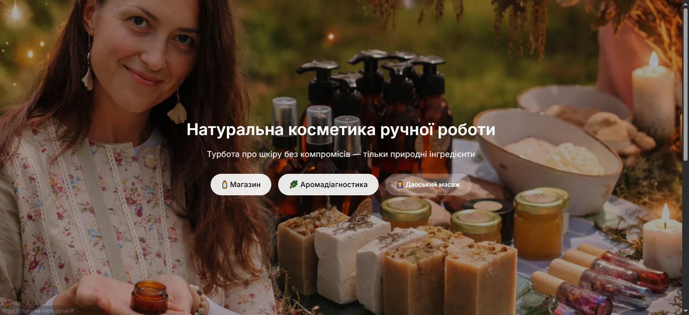
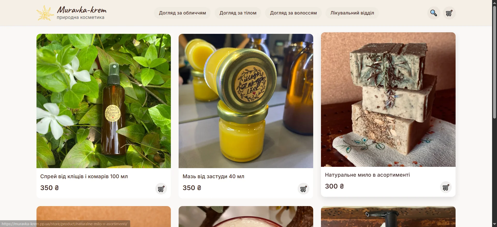
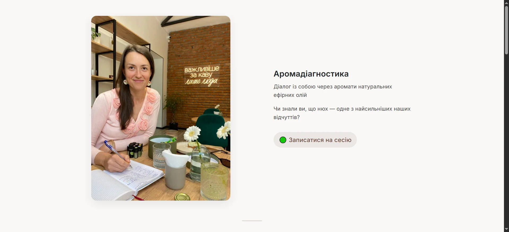
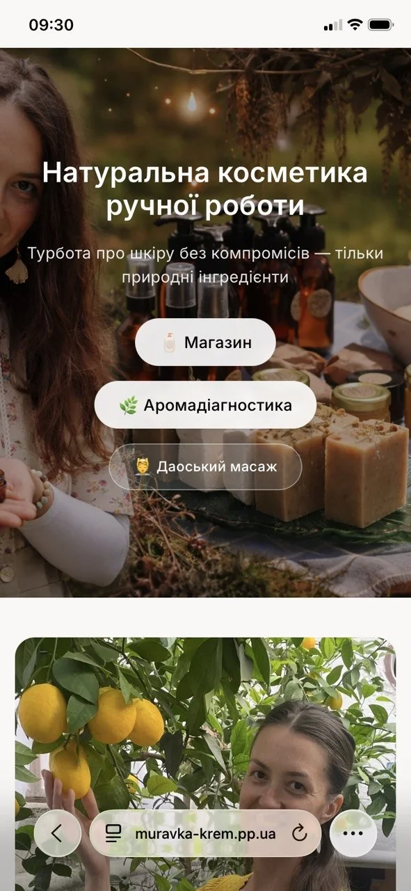

# Muravka-krem

Production-ready Django web application for a natural cosmetics brand with e-commerce functionality, aromadiagnostics service pages, OAuth authentication, analytics integration, and automated deployment pipeline.

---

## 🌿 About the Project

Muravka-krem is a custom-built website for a handmade natural cosmetics brand.

The project combines:

- marketing landing pages
- online store
- aromadiagnostics service presentation
- product catalog
- authentication system
- analytics
- cloud media storage
- production infrastructure

The application was designed and deployed as a full-stack production project with focus on clean architecture, responsive UX, SEO, and maintainable deployment workflow.

---

## ✨ Features

### Website & Content

- Responsive landing pages
- Product catalog with categories
- Product search
- Pagination
- Aromadiagnostics service page
- Gift certificate section
- About / brand presentation pages

### E-commerce

- Shopping cart
- Checkout flow
- Product detail pages
- Category filtering

### Authentication

- Google OAuth login via django-allauth
- Email-based authentication
- Custom allauth configuration

### Media & Analytics

- Cloudinary media storage
- Google Analytics 4 integration
- SEO-friendly structure
- UTM campaign support

### Infrastructure & Deployment

- AWS EC2 deployment
- Nginx reverse proxy
- Gunicorn application server
- PostgreSQL in production
- SQLite for local development
- HTTPS with Let's Encrypt
- GitHub Actions CI/CD pipeline

---

## 🛠 Tech Stack

### Backend

- Python
- Django 6
- PostgreSQL
- SQLite

### Frontend

- HTML5
- CSS3
- JavaScript

### Infrastructure

- AWS EC2 (Ubuntu 24.04)
- Gunicorn
- Nginx
- Let's Encrypt

### Third-Party Services

- Cloudinary
- Google Analytics 4
- Google OAuth

### DevOps

- GitHub Actions
- CI/CD deployment pipeline

---

## 🏗 Architecture

```text
Client Browser
       ↓
     Nginx
       ↓
   Gunicorn
       ↓
     Django
       ↓
PostgreSQL / SQLite
```

---

## ⚙️ Environment Configuration

The project uses separate database configurations for local and production environments.

### Local Development

- SQLite
- DEBUG=True

### Production

- PostgreSQL
- DEBUG=False
- HTTPS enabled

Example logic:

```python
if os.getenv('USE_SQLITE') == 'True':
    # SQLite config
else:
    # PostgreSQL config
```

---

## 🚀 Deployment

Production deployment includes:

- AWS EC2 Ubuntu server
- Gunicorn process management
- Nginx reverse proxy
- SSL certificates via Let's Encrypt
- HTTP → HTTPS redirects
- GitHub Actions auto-deploy

Deployment flow:

```text
git push
   ↓
GitHub Actions
   ↓
SSH deploy to EC2
   ↓
Application restart
```

---

## 🔐 Authentication

Implemented with:

- django-allauth
- Google OAuth provider
- Site-aware SocialApp configuration

Customized authentication flow:

- email-only login
- username-less authentication
- simplified signup process

---

## 📱 Responsive Design

The UI was optimized for:

- desktop devices
- tablets
- mobile phones

Improvements include:

- mobile typography adjustments
- left-aligned mobile content
- responsive CTA sections
- optimized landing layout

---

## 📂 Main Sections

### Landing

Main marketing homepage with brand presentation.

### Store

Online shop with:

- categories
- search
- pagination
- cart
- checkout

### Aromadiagnostics

Dedicated service landing page including:

- process explanation
- natural tools presentation
- certification section
- gift certificate CTA

---

## 🧠 Challenges Solved

### Database Environment Separation

Implemented conditional database configuration for:

- SQLite (development)
- PostgreSQL (production)

### Production SSL & Proxy Handling

Configured:

- `SECURE_PROXY_SSL_HEADER`
- HTTPS redirects
- Nginx proxy forwarding

### OAuth Integration

Resolved:

- SocialApp configuration issues
- local/production environment inconsistencies

### Production Stability

Investigated and resolved:

- Gunicorn worker hangs
- Nginx upstream timeout issues
- deployment synchronization problems

---

## 📸 Screenshots

### Homepage

<p align="center">
  
</p>

### Store

<p align="center">
  
</p>

### Aromadiagnostics

<p align="center">
  
</p>

### Mobile Version Homepage

<p align="center">
  
</p>

### Mobile Version Store

<p align="center">
  
</p>

---

## 🔧 Local Setup

```bash
# Clone repository
git clone <repository_url>

# Create virtual environment
python -m venv venv

# Activate environment
source venv/bin/activate

# Install dependencies
pip install -r requirements.txt

# Run migrations
python manage.py migrate

# Start development server
python manage.py runserver
```

---

## 📈 Future Improvements

- Nova Poshta integration
- Online payments
- Product reviews
- Admin analytics dashboard
- Email automation
- Multilingual support

---

## 👨‍💻 Author

Developed by Evgeniy Gusarov.

Backend-focused Python/Django developer with experience in:

- production deployment
- cloud infrastructure
- authentication systems
- CI/CD automation
- responsive web applications

---

## 📄 License

This project is intended for portfolio and educational demonstration purposes.