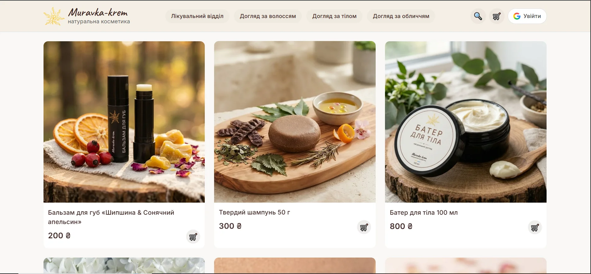
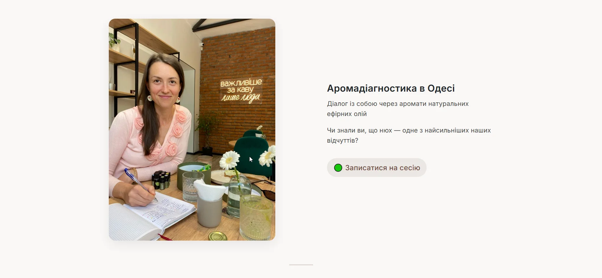
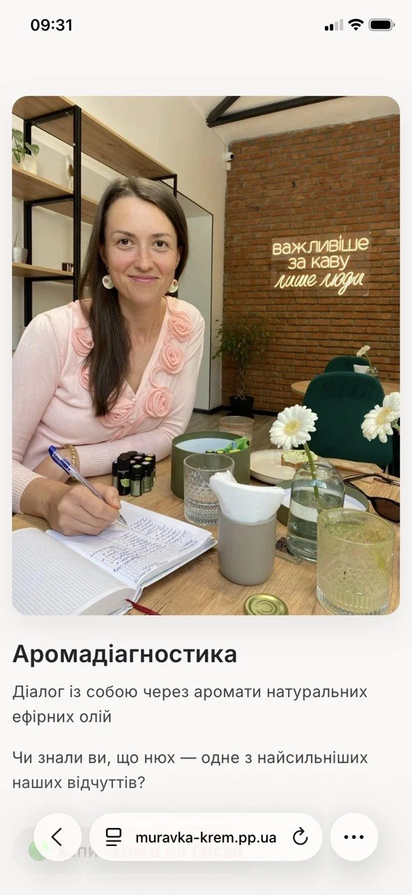

# Muravka-krem

Production-ready Django web application for a natural cosmetics brand featuring multilingual support, e-commerce functionality, Google OAuth authentication, SEO optimization, analytics integration, and automated AWS deployment.

---

## 🌿 About the Project

Muravka-krem is a Django web application for a handmade natural cosmetics brand.

The project demonstrates a production-ready implementation of an e-commerce platform combined with service-based landing pages, multilingual content, Google OAuth authentication, SEO optimization, and automated deployment on AWS infrastructure.

---

## ✨ Features

### Website & Content

* Responsive landing pages
* Multilingual interface (Ukrainian / Russian)
* Localized product names and descriptions
* Product catalog with categories
* Product search
* Pagination
* Aromadiagnostics service page
* Gift certificate section
* About / brand presentation pages

### E-commerce

* Shopping cart
* Checkout flow
* Product catalog with search and category filtering
* Nova Poshta API integration (delivery point selection during checkout)

### Authentication

* Google OAuth 2.0 authentication implemented using django-allauth
* Password-based authentication is disabled
* Users are provisioned automatically from Google account data
* Simplified authentication flow (no signup/password management)

### SEO & Analytics

* SEO-friendly multilingual architecture
* Canonical URLs
* hreflang alternate tags
* XML sitemap generation
* Cloudinary media storage
* Google Analytics 4 integration
* UTM campaign support

### Infrastructure & Deployment

* AWS EC2 deployment
* Nginx reverse proxy
* Gunicorn application server
* PostgreSQL in production
* SQLite for local development
* HTTPS with Let's Encrypt
* GitHub Actions CI/CD pipeline

---

## 🛠 Tech Stack

### Backend

* Python
* Django 6
* PostgreSQL (production)
* SQLite (development)

### Frontend

* HTML5
* CSS3
* JavaScript

### Infrastructure

* AWS EC2 (Ubuntu 24.04)
* Nginx
* Gunicorn
* Let's Encrypt SSL

### Integrations

* Google OAuth 2.0 (django-allauth)
* Google Analytics 4
* Cloudinary
* Nova Poshta API

### DevOps

* GitHub Actions
* CI/CD deployment pipeline

---

## 🏗 Architecture

```text
Client Browser
       ↓
     Nginx
       ↓
   Gunicorn
       ↓
     Django
       ↓
PostgreSQL / SQLite
```

---

## ⚙️ Environment Configuration

The project uses separate database configurations for local and production environments.

### Local Development

* SQLite
* DEBUG=True

### Production

* PostgreSQL
* DEBUG=False
* HTTPS enabled

Example configuration:

```python
if os.getenv("USE_SQLITE") == "True":
    # SQLite configuration
else:
    # PostgreSQL configuration
```

---

## 🚀 Deployment

Production deployment includes:

* AWS EC2 Ubuntu server
* Gunicorn process management
* Nginx reverse proxy
* SSL certificates via Let's Encrypt
* HTTP → HTTPS redirects
* GitHub Actions automatic deployment

Deployment flow:

```text
git push
   ↓
GitHub Actions
   ↓
SSH deploy to EC2
   ↓
Application restart
```

---

## 🔐 Authentication

The application uses Google OAuth 2.0 (django-allauth) as the sole authentication method.

Features include:

* No password-based authentication
* No username-based login
* Automatic user provisioning from Google account data
* Simplified authentication flow
* Secure OAuth-based authentication

---

## 🌍 Internationalization

The application supports multilingual content using Django's internationalization framework.

Implemented features:

* Ukrainian and Russian interface
* Localized product names and descriptions
* Language-aware URLs
* Language switcher
* Canonical URLs
* hreflang alternate links
* Multilingual XML sitemap

---

## 📱 Responsive Design

The interface is optimized for:

* Desktop devices
* Tablets
* Mobile phones

Responsive improvements include:

* Mobile typography adjustments
* Left-aligned mobile content
* Responsive CTA sections
* Optimized landing page layouts

---

## 📂 Main Sections

### Landing

Marketing homepage introducing the brand and its philosophy.

### Store

Online shop featuring:

* Product catalog
* Categories
* Search
* Pagination
* Shopping cart
* Checkout

### Aromadiagnostics

Dedicated landing page describing the aromadiagnostics service, including:

* Service overview
* Diagnostic process
* Natural tools presentation
* Certification section
* Gift certificate CTA

---

## 🧠 Challenges Solved

### Database Environment Separation

Implemented conditional database configuration for:

* SQLite (development)
* PostgreSQL (production)

### Production SSL & Reverse Proxy

Configured:

* `SECURE_PROXY_SSL_HEADER`
* HTTPS redirects
* Nginx reverse proxy

### Google OAuth Integration

Resolved:

* SocialApp configuration
* Environment-specific OAuth settings
* Production authentication workflow

### Internationalization (i18n)

Implemented:

* Ukrainian and Russian localization
* Language-aware routing
* Canonical URLs
* hreflang alternate tags
* Multilingual XML sitemap
* Localized product and category content

### Production Stability

Investigated and resolved:

* Gunicorn worker hangs
* Nginx upstream timeout issues
* Deployment synchronization problems

---

## 📸 Screenshots

### Homepage

<p align="center">
  
</p>

### Store

<p align="center">
  
</p>

### Aromadiagnostics

<p align="center">
  
</p>

### Mobile Homepage

<p align="center">
  
</p>

### Mobile Store

<p align="center">
  
</p>

### Mobile Aromadiagnostics

<p align="center">
  
</p>

---

## 🔧 Local Setup

```bash
# Clone repository
git clone <repository_url>

# Create virtual environment
python -m venv venv

# Activate virtual environment
source venv/bin/activate

# Install dependencies
pip install -r requirements.txt

# Apply migrations
python manage.py migrate

# Start development server
python manage.py runserver
```

---

## 📈 Future Improvements

* English localization
* Online payment integration (LiqPay / Stripe)
* Product reviews and ratings
* Admin dashboard with sales and traffic analytics

---

## 👨‍💻 Author

**Evgeniy Gusarov** — Python/Django Backend Developer.

Interested in building production-ready web applications with focus on:

* Django backend development
* REST APIs
* AWS deployment and infrastructure
* CI/CD automation
* Authentication systems (OAuth 2.0)
* SEO-friendly web applications
* E-commerce architecture

---

## 📄 License

This project is intended for portfolio and educational demonstration purposes.
